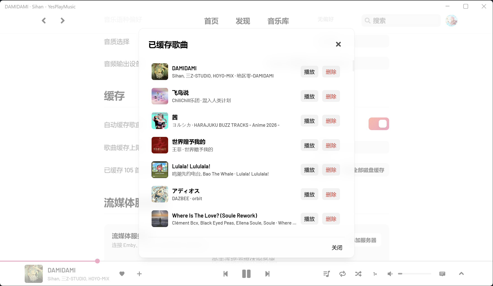
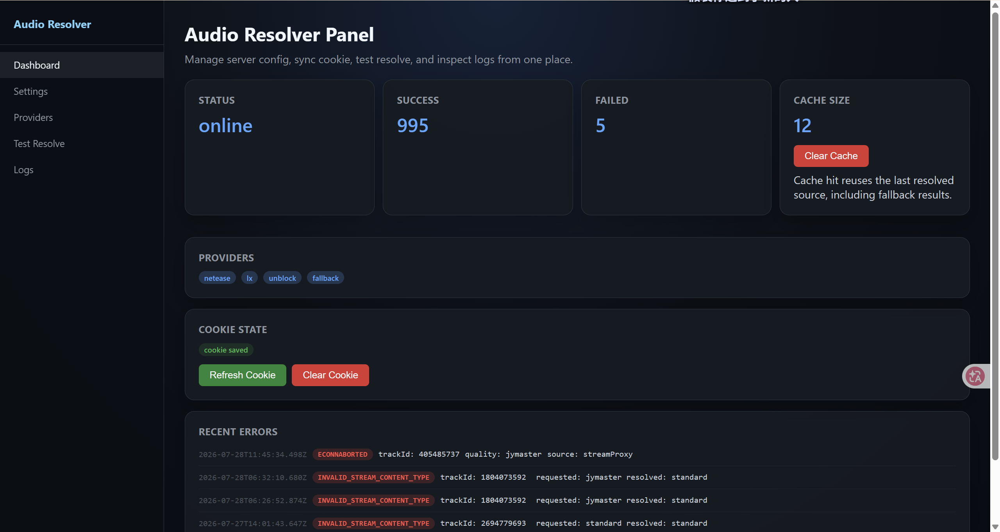
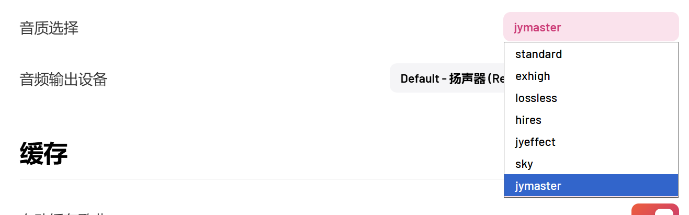
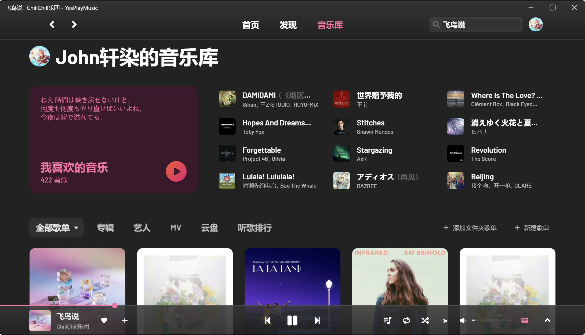

<p align="center">
  
</p>

<h1 align="center">YesPlayMusic</h1>

<p align="center">
  面向桌面端与自托管场景的现代音乐播放器
  <br>
  集成网易云音乐、本地音乐、流媒体服务器与可扩展音频解析
</p>

<p align="center">
  <a href="https://github.com/axuanran/YesPlayMusic/releases/latest"></a>
  <a href="https://github.com/axuanran/YesPlayMusic/actions/workflows/build.yaml"></a>
  <a href="https://github.com/axuanran/YesPlayMusic/stargazers"></a>
  <a href="LICENSE"></a>
</p>

<p align="center">
  <a href="https://github.com/axuanran/YesPlayMusic/releases/latest"><strong>下载客户端</strong></a>
  ·
  <a href="https://github.com/axuanran/YesPlayMusic/wiki"><strong>项目 Wiki</strong></a>
  ·
  <a href="https://github.com/axuanran/YesPlayMusic/issues"><strong>问题反馈</strong></a>
  ·
  <a href="https://t.me/ypmaxuanran"><strong>Telegram 频道</strong></a>
</p>

---

## 项目简介

这是 YesPlayMusic 的一个持续开发分支。项目保留原版清爽的网易云音乐体验，并围绕现代前端架构、桌面系统集成、本地媒体库和音频可用性持续演进。

当前前端基于 Vue 3 与 Vite，桌面端基于 Electron 和 `electron-vite`，同时提供 Web、Docker 与终端界面。Windows 和 Linux 是主要测试平台；macOS 及部分 ARM 构建由 CI 提供，实际兼容性可能因系统环境而异。

> 本项目是非官方第三方客户端，与网易云音乐官方无关。部分在线能力和第三方音源会受到账号权限、网络环境及上游接口变化影响。

## 界面预览

<p align="center">
  
</p>

<p align="center"><sub>沉浸式播放与多行歌词</sub></p>

<table>
  <tr>
    <td width="50%"></td>
    <td width="50%"></td>
  </tr>
  <tr>
    <td align="center"><sub>缓存浏览与离线播放</sub></td>
    <td align="center"><sub>音频 Resolver 状态与 Provider 管理</sub></td>
  </tr>
</table>

<details>
<summary>查看更多界面截图</summary>

<br>






</details>

## 核心能力

| 模块 | 能力概览 |
| --- | --- |
| 网易云音乐 | Cookie 与网页登录、每日推荐、私人 FM、云盘、MV、搜索、收藏和歌单管理 |
| 音频解析 | Netease、LX、UnblockNeteaseMusic、Fallback Provider；音质选择、灰色歌曲替换、缓存与管理面板 |
| 本地音乐 | 文件夹扫描、元数据与封面读取、本地歌词匹配、文件夹歌单及统一播放队列 |
| 流媒体 | 连接 Emby、Jellyfin 等兼容服务器，浏览并播放专辑、歌手和歌曲 |
| 歌词体验 | 滚动歌词、翻译与发音歌词、独立桌面歌词、AMLL WebSocket 同步 |
| 桌面集成 | Windows SMTC、Linux MPRIS、Discord Rich Presence、系统托盘、全局快捷键与自动更新 |
| 播放体验 | 音质与输出设备选择、播放速度、缓存播放、媒体按键、深浅色主题与低性能模式 |
| 其他形态 | Web / PWA、Docker 自托管、基于 mpv 的 TUI |

音频 Resolver 采用 Provider 链管理不同来源，可查看解析状态、测试歌曲、调整 Provider 顺序并管理缓存。第三方 Provider 的可用性不作长期保证。

## 平台与分发

| 平台 | 可用形式 | 说明 |
| --- | --- | --- |
| Windows x64 | NSIS 安装包、Portable | 主要测试平台 |
| Linux x64 | AppImage、deb、rpm、tar.gz、snap、pacman | 主要测试平台 |
| Linux ARM | deb、tar.gz | CI 构建支持 |
| Arch Linux | [AUR：yesplaymusic-axuanran-bin](https://aur.archlinux.org/packages/yesplaymusic-axuanran-bin) | 二进制包 |
| Gentoo | `media-sound/yesplaymusic-bin` | 通过 xr-overlay 安装 |
| macOS | Intel 与 Apple Silicon dmg | CI 构建，测试覆盖有限 |
| Docker | Compose、GHCR 镜像 | 适合 Web 自托管 |
| Web / PWA | Vite Web 应用 | 支持 |

## 安装

### 桌面客户端

请从 [Releases](https://github.com/axuanran/YesPlayMusic/releases/latest) 下载适用于当前系统的安装包。普通用户建议选择标记为 **Latest** 的正式版本；prerelease 包含较新的改动，更适合测试与反馈。

- Windows：优先选择 `Setup.exe`，免安装使用可选择 `yesplaymusic.exe`。
- Linux：按发行版选择 AppImage、deb、rpm、tar.gz、snap 或 pacman 包。
- macOS：根据设备选择 x64 或 ARM64 dmg；当前构建可能需要自行处理系统签名提示。

AppImage 首次运行前需要添加执行权限：

```bash
chmod +x YesPlayMusic-*.AppImage
./YesPlayMusic-*.AppImage
```

### Arch Linux

```bash
yay -S yesplaymusic-axuanran-bin
```

也可以将 `yay` 替换为其他 AUR Helper，例如 `paru`。

### Gentoo

```bash
sudo eselect repository add xr-overlay git https://github.com/axuanran/xr-overlay.git
sudo emaint sync -r xr-overlay
```

该软件包当前使用测试关键字。amd64 用户可执行：

```bash
sudo mkdir -p /etc/portage/package.accept_keywords
echo "media-sound/yesplaymusic-bin ~amd64" | \
  sudo tee /etc/portage/package.accept_keywords/yesplaymusic
sudo emerge -av media-sound/yesplaymusic-bin
```

arm64 用户请将 `~amd64` 替换为 `~arm64`。维护和发布说明见 [Gentoo 打包文档](docs/gentoo-package.md)。

## Docker 部署

Docker Compose 会启动 YesPlayMusic Web 服务、内置网易云音乐 API、Audio Resolver，以及独立的 UnblockNeteaseMusic 辅助服务。

```bash
mkdir YesPlayMusic && cd YesPlayMusic
wget https://raw.githubusercontent.com/axuanran/YesPlayMusic/refs/heads/dev/docker-compose.yml
docker compose pull
docker compose up -d
```

启动后访问 `http://localhost`。运行数据和 Resolver 配置保存在 `yesplaymusic-data` 数据卷中。

常用维护命令：

```bash
docker compose ps          # 查看状态
docker compose logs -f     # 跟踪日志
docker compose down        # 停止服务
```

默认镜像为 `ghcr.io/axuanran/yesplaymusic:latest`。长期部署建议通过环境变量固定 Release 标签：

```bash
YESPLAYMUSIC_IMAGE=ghcr.io/axuanran/yesplaymusic:<tag> docker compose up -d
```

<details>
<summary>使用单容器运行</summary>

```bash
docker run -d \
  --name yesplaymusic \
  --restart always \
  -p 80:80 \
  -v yesplaymusic-data:/data \
  ghcr.io/axuanran/yesplaymusic:latest
```

单容器模式不包含独立的 UnblockNeteaseMusic 服务。

</details>

## TUI

项目提供基于 `mpv` 的终端界面，支持网易云登录与 Cookie 同步、搜索、私人 FM 和终端播放。请先确保系统中已安装 mpv。

```bash
yarn tui                 # 从源码运行
yesplaymusic --tui       # 从桌面程序启动
yesplaymusic-tui         # 运行独立 TUI 产物
```

<details>
<summary>查看 TUI 截图</summary>

<br>


</details>

## 开发指南

### 环境要求

- Node.js `>=22 <26`
- Yarn `1.22.22`
- Git
- 对应平台的 Electron 构建依赖

### 本地启动

```bash
git clone --branch dev --recursive https://github.com/axuanran/YesPlayMusic.git
cd YesPlayMusic
corepack enable
yarn install
```

复制环境变量文件：

```bash
cp .env.example .env
```

Windows PowerShell 请使用：

```powershell
Copy-Item .env.example .env
```

### 常用命令

| 命令 | 用途 |
| --- | --- |
| `yarn dev` | 启动 Web 开发环境 |
| `yarn desktop:dev` | 启动 Electron 开发环境 |
| `yarn tui` | 启动 TUI |
| `yarn lint` | 执行代码检查 |
| `yarn test` | 运行测试 |
| `yarn build` | 构建 Web 应用 |
| `yarn verify` | 依次执行 lint、test 与 build |

如果 Electron 二进制或原生依赖安装不完整，可运行 `yarn electron:repair-and-serve` 进行修复并重新启动。

<details>
<summary>桌面端构建命令</summary>

| 命令 | 产物 |
| --- | --- |
| `yarn desktop:build` | 当前平台桌面构建 |
| `yarn electron:build-win-dir` | Windows 未打包目录，适合快速验证 |
| `yarn electron:build-win-installer` | Windows NSIS 安装包 |
| `yarn electron:build-win-portable` | Windows Portable |
| `yarn electron:build-linux` | Linux 桌面包 |
| `yarn electron:build-mac` | macOS dmg |

Web 构建输出到 `dist`，桌面构建输出到 `dist_electron`。跨平台发布建议使用项目的 GitHub Actions 工作流。

</details>

## 技术架构

- 前端：Vue 3、Vue Router 4、Vuex 4、Vue I18n、Vite、Sass
- 桌面端：Electron、electron-vite、electron-builder、electron-updater
- 服务与媒体：Node.js、Express、NeteaseCloudMusicApi Enhanced、UnblockNeteaseMusic、music-metadata、mpv
- 工程质量：Vitest、ESLint、Prettier、GitHub Actions

```text
YesPlayMusic
├── src/         前端、播放器、插件与 Electron 代码
├── server/      Audio Resolver 与管理接口
├── admin/       Resolver 管理页面
├── scripts/     构建、发布与 TUI 脚本
├── docs/        功能与打包文档
└── .github/     CI、发布及发行版配置
```

## 发布与贡献

`dev` 是主要开发分支。推送到该分支后，GitHub Actions 会生成 prerelease；正式版本通过 Release 流程发布。规划文档和开发分支中的内容不代表当前正式版本已经完整提供。

欢迎提交 Bug 修复、平台适配、音频 Provider、文档、翻译和自动化测试。Pull Request 请以 `dev` 为目标分支，并尽量说明改动目的、验证方式和受影响平台。

提交问题前请先搜索已有 [Issues](https://github.com/axuanran/YesPlayMusic/issues)。新问题建议附上：

- YesPlayMusic 版本、操作系统及安装包类型
- 是否使用 Docker 或第三方媒体服务器
- 可复现的操作步骤
- 相关日志和必要截图

## 致谢与许可

本项目基于 [qier222/YesPlayMusic](https://github.com/qier222/YesPlayMusic)，并使用或参考以下项目：

- [NeteaseCloudMusicApi Enhanced](https://github.com/neteasecloudmusicapienhanced/api-enhanced)
- [UnblockNeteaseMusic](https://github.com/UnblockNeteaseMusic/server)

感谢原项目作者、所有贡献者，以及持续参与测试和反馈的用户。

项目基于 [MIT License](LICENSE) 开源。使用本项目时，请同时遵守相关平台、媒体服务器及第三方服务的服务条款和所在地区法律法规。

---

<p align="center">
  如果这个项目对你有帮助，欢迎 Star 或参与贡献。
</p>
